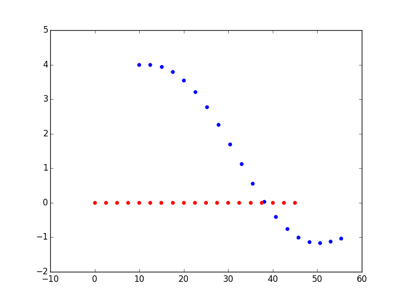

# Polynomial Playground (making PTG work)

From Udacity Self-Driving Car Nanodegree.

Before beginning the final project, this is a chance to play around with cost function design and weight tweaking. In the Python code provided, you have a working Polynomial Trajectory Generator. You can see it in action by doing the following:

## Getting Started
- Project code provided via  **TrajectoryExercise2**.
- From the project's directory, run `python evaluate_ptg.py`. You should see a plot similar to the one below. This plot shows the s (x-axis) and d(y-axis) trajectories followed by a vehicle in traffic (red) and a self driving car (blue).

In this situation, the self driving car was trying to get behind the target vehicle, but the cost functions it was using weren't weighted appropriately and so it didn't behave as expected.

## Fixing the Problem(s)
There are 5 files in the provided code. You'll probably want to start by modifying cost function weights in ptg.py but may also want to add cost functions of your own. As a bonus challenge try implementing this same code in C++.

## File Descriptions
1. `ptg.py` - The primary code for generating a polynomial trajectory for some constraints. This is also where weights are assigned to cost functions. Adjusting these weights (and possibly adding new cost functions), can have a big effect on vehicle behavior.
2. `cost_functions.py` - This file contains many cost functions which are used in ptg.py when selecting the best trajectory. Some cost functions aren't yet implemented...
3. `evaluate_ptg.py` - This file sets a start state, goal, and traffic conditions and runs the PTG code. Feel free to modify the goal, add traffic, etc... to test your vehicle's trajectory generation ability.
4. `constants.py` - constants like speed limit, vehicle size, etc...
5. `helpers.py` - helper functions used by other files.

## Supporting Materials
- [Trajectoryexercise2](http://video.udacity-data.com.s3.amazonaws.com/topher/2017/October/59d5bfcb_trajectoryexercise2/trajectoryexercise2.zip)

- [Trajectoryexercise2_python3](https://d17h27t6h515a5.cloudfront.net/topher/2017/December/5a3ea459_trajectoryexercise2-python3/trajectoryexercise2-python3.zip)
